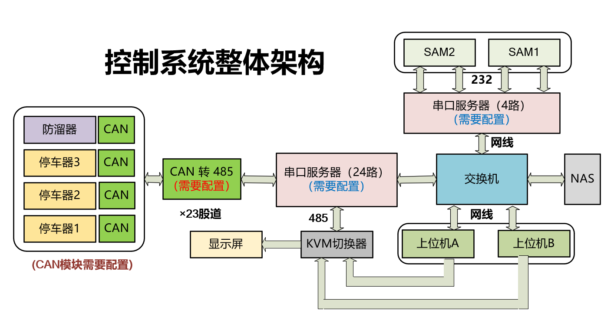
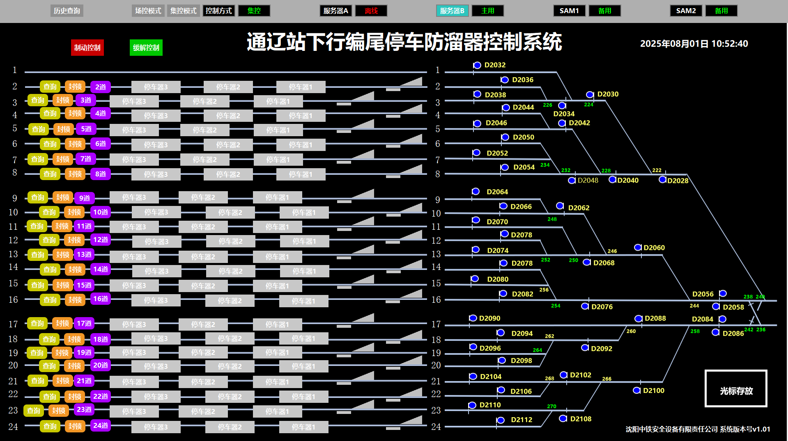

# Tongliao Station Brake Control System
通辽站铁路停车器控制系统，包括上位机（控制系统），下位机（防溜器）以及与SAM的接口。该github仓库的合作者：[Polaris-SJTU](https://github.com/Polaris-SJTU)，[Lyricfy](https://github.com/Lyricfy) and [wcffff](https://github.com/wcffff)

***

## 1.停车器与SAM及下位机硬件结构图

停车器控制系统又如下模块组成：
* 下位机（1路防溜器和3路停车器）
* 下位机的CAN模块（需要配置）
* CAN转485通信模块（需要配置）
* 串口服务器（需要配置）
* 交换机（用于TCP通信，获取IP）
* NAS（共享存储）
* 上位机（停车器控制系统软件）
* SAM（铁科院自动控制系统）

具体接线见下图：

需要配置的模块：
* 串口服务器见智嵌物联官网（配一下485和232的波特率以及端口号），见链接:[串口服务器](https://www.zhiqwl.com/list_146/401.html)
* CAN模块及CAN转485（配置CAN和485的波特率，CAN模块需要配置ID号，同一CAN网络下的ID号不能相同）。见链接：[CAN转485](https://www.zhiqwl.com/list_130/192.html)，[CAN模块](https://www.zhiqwl.com/list_130/190.html)
* 注：485串口波特率设置为115200，CAN模块波特率100k，SAM的232串口波特率为9600

## 2.上位机与SAM通信

详细指令集可见[上位机与SAM接口协议](./通辽站SAM与停车器控制系统接口协议.pdf)。文件中有部分不清楚的地方，在此进行详细说明。其中，上位机所发送的通讯帧不是利用定时器完成的，而是针对SAM系统的消息，收一发一（这点和pdf中不一致，很重要）。数据帧的种类见下表：

| 类别   | 帧信息汇总                                                                                                                                                                                                 |
|--------|----------------------------------------------------------------------------------------------------------------------------------------------------------------------------------------------------------|
| 通讯控制 | <table style="width:100%"><tr><th style="width:30%; text-align:left">帧名称</th><th style="width:15%; text-align:left">值</th><th style="width:55%; text-align:left">用途</th></tr><tr><td>DC2（通讯请求）</td><td>0x12</td><td>SAM 请求建立连接</td></tr><tr><td>DC3（通讯允许）</td><td>0x13</td><td>上位机同意建立连接</td></tr><tr><td>ACK（确认）</td><td>0x06</td><td>接收数据确认或心跳，未收到回复则 SAM 定时发送</td></tr><tr><td>NACK（非确认）</td><td>0x15</td><td>接收数据错误</td></tr><tr><td>SDI（停车、防溜表示信息帧）</td><td>0x85</td><td>上位机向 SAM 报告状态</td></tr><tr><td>BCC（控制命令）</td><td>0x95</td><td>SAM 向上位机传送控制命令</td></tr></table> |
| 数据传送 | <table style="width:100%"><tr><th style="width:30%; text-align:left">帧名称</th><th style="width:15%; text-align:left">值</th><th style="width:55%; text-align:left">用途</th></tr><tr><td>TSQ（时钟同步请求）</td><td>0x9a</td><td>上位机向 SAM 请求时钟信息</td></tr><tr><td>TSD（时钟同步数据）</td><td>0xa5</td><td>SAM 传送当前时钟</td></tr><tr><td>ACQ（集中控制请求）</td><td>0x75</td><td>SAM 请求转为集中控制模式</td></tr><tr><td>ACA（集中控制同意）</td><td>0x7a</td><td>SAM 同意转为集中控制模式</td></tr><tr><td>RSR（运行状态报告）</td><td>0xaa</td><td>相互传送运行状态（主备/集控场控状态）</td></tr></table> |

#### 建立链接过程
SAM发送DC2，上位机回复DC3，SAM发送RSR，下位机回复RSR，SAM回复ACK。此时我们可以认为建链完成

#### 上位机回复SAM的方式
* 建链后，上位机收到ACK或者BCC消息，统一回复SDI即可
* 若上位机需要发送TSQ（更改时钟），ACQ（请求集控），RSR（报告主备状态及控制模式），则在要发送的SDI之前插队发送，而不是收到ACK回复SDI。上位机收到SAM的回复后，发送ACK表示确认收到，SAM回复ACK，上位机回复发送SDI即可

#### 发送序号与确认序号
* **发送序号：** 上位机发送的命令得到SAM回复后更改发送序号。若发送的为数据传送帧，得到确认后，上位机端发送序号加1；若为通讯控制帧则不加
* **确认序号：** 将收到SAM消息中的发送序号作为自己的确认序号进行发送

#### 上位机与SAM双机通讯
部分指令只在上位机主机与SAM主机见收发。详见[上位机与SAM接口协议](./通辽站SAM与停车器控制系统接口协议.pdf)最后一页

## 3.上位机代码逻辑及功能
上位机用PyQT5和QTDesigner编写，文件结构如下：
* [confirm.py](./BrakeControlSystemGUI/modules/confirm.py)文件：场控与集控交权确认界面
* [logger.py](./BrakeControlSystemGUI/modules/logger.py)文件: 上位机状态日志记录
* [hot_standby.py](./BrakeControlSystemGUI/modules/hot_standby.py)文件： 双机热备功能实现，检测上位机AB机的主备状态
* [sound.py](./BrakeControlSystemGUI/modules/sound.py)文件: 语音播报功能实现，播报下位机故障状态
* [tcp_client.py](./BrakeControlSystemGUI/modules/tcp_client.py)文件 :用于创建tcp通讯类，并继承该类实现与下位机的通讯功能
* [up_link.py](./BrakeControlSystemGUI/modules/up_link.py)文件 :继承tcp通讯类，实现与上位机的通讯功能
* [gui.py](./BrakeControlSystemGUI/modules/gui.py)文件 :用于实现主界面的按钮切换功能与逻辑，将所有模块的子功能集合到该类中
* [build.py](./BrakeControlSystemGUI/build.py)文件 ：用于生成exe文件
* [main.py](./BrakeControlSystemGUI/main.py)文件 :程序运行文件

上位机与下位机见的通讯协议见[通信协议](./上位机与下位机-通信协议.pdf)，下位机（停车器与防溜器）状态分别见[防溜器](./通辽防溜器下位机状态说明.pdf)，[停车器](./通辽TCY停车器下位机状态说明.pdf)

最终上位机界面见下图。具体功能需要根据后续站点安排调整

#### 通辽站上位机功能：

|功能类别|具体功能|说明|
| ---- | ---- | ---- |
|模式管理|模式切换|场控模式、集控模式切换|
||制动与缓解控制|通过单股道上的按钮选中指定设备，利用“制动控制”“缓解控制”按钮，实现单一或整股道的停车防溜器制动、释放操作|
||封锁与解锁|利用单股道上锁闭解锁按钮，显示当前是否处于封锁状态，以及修改封锁状态|
||查询|出现控制指令下发故障情况，查询是否有通讯故障，没有则恢复接收下位机状态表示|
|状态监控|设备状态显示|股道设备按钮的颜色和形状实时展示各股道停车器与防溜器状态、股道封锁状态|
||服务器状态监控|监控服务器A，B（主用）状态|
||SAM设备状态监控|显示SAM1、SAM2状态|
|数据查询与显示|历史查询|通过“历史查询”按钮，可查设备操作、下位机状态与故障信息|
||实时时间显示|界面右上角显示系统时间（2025年07月03日 16:37:12 ）|

## 4.下位机程序与硬件原理图文件
* stm32数据手册见：[手册](./stm32h723数据手册.pdf)
* 防溜器下位机：[下位机stm32程序](./BrakeControlSystem_stm32_v1/)，[原理图](./ProPrj_火车制动系统-防溜器_2025-06-22.epro)
* 信阳站手动控制台（通辽站未使用）：[手控台stm32程序](./ManuelControlSystem_stm32_v1/)，[原理图](./ProPrj_火车手动控制开关_2025-05-28.epro)

